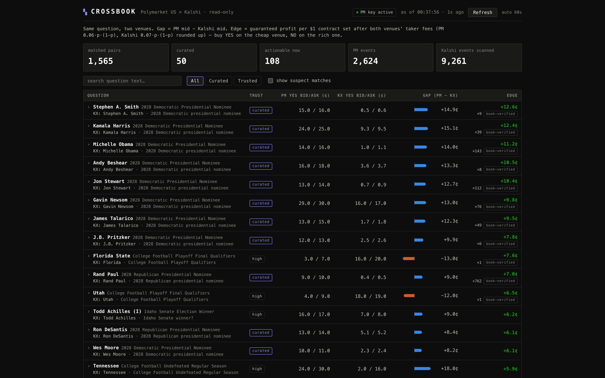
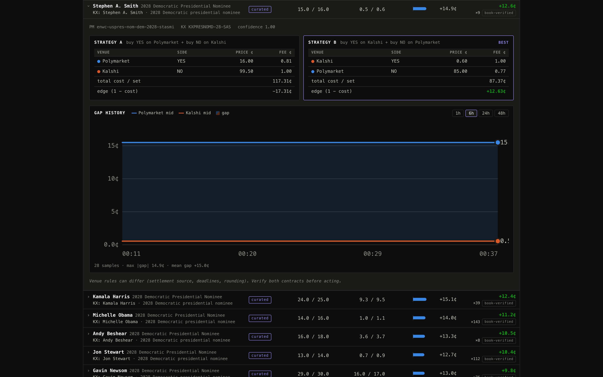

# Crossbook

A read-only terminal that matches identical prediction-market questions across [Polymarket US](https://polymarket.us) and Kalshi, computes fee-adjusted, order-book-verified cross-venue arbitrage edges, and tracks price divergence over time. Built in about a day against both venues' public APIs.





## The idea

A binary prediction contract settles at $1 if the outcome happens and $0 if it doesn't. The same question — "Will the Fed cut in September?", "Will X win the 2028 nomination?" — often trades on both Polymarket US and Kalshi at different prices.

When it does, there's a mechanical trade: buy YES on the cheap venue and NO on the rich one, and the pair pays out exactly $1 at settlement no matter which way the outcome goes. That's a locked-in profit — **if** the two questions are truly identical, and **if** the price gap clears both venues' taker fees: Polymarket charges `0.06·p·(1−p)` per contract, Kalshi charges `0.07·p·(1−p)` rounded *up* to the next cent, which makes small Kalshi fills relatively more expensive.

The arithmetic is trivial. The hard problem is **matching**. Title similarity cannot see that "CPI YoY" is not "CPI MoM", or that two venues resolve "by end of year" against different deadlines or settlement sources. A naive matcher will happily report a 20¢ "riskless" edge that is actually two different questions.

## How it deals with that

Every pair carries a trust level, and the math it's allowed to show depends on it:

- **Curated** — hand-verified slug↔ticker mappings in [`curated-pairs.json`](curated-pairs.json) (~50 pairs, including the September 2026 Fed decision legs). Full arb math, ranked first.
- **High** — automatic matches where both the event titles and the outcome titles are near-exact. Full arb math, but watched skeptically (below).
- **Low** — loose fuzzy matches. Shown as a review queue with the raw price gap only — **no arb math at all**, because at this trust level a big gap is evidence of a mismatch, not of money.

On top of the ladder, a set of suspect heuristics demote anything that looks too good:

- Any **non-curated** pair showing more than an 8¢ "riskless" edge is presumed mismatched. Between two regulated venues, genuine cross-venue edges are a few cents; a 20¢ edge is almost always a unit or deadline difference the title comparison can't see.
- Absolute mid-price gaps above thresholds (15¢ for auto matches, 25¢ even for high-trust ones) flag the pair as suspect and rank it last.
- **In-play** events (live sports on the Polymarket side) are demoted: quotes move second to second, so an apparent cross-venue edge is usually staleness, not opportunity.
- **Phantom edges** are demoted: if a book check finds zero executable sets at top-of-book, a positive edge on an empty book ranks as noise.

Finally, nothing is presented as an actionable edge from cached quotes alone. The event-feed quotes on both venues lag their matching engines, so every headline edge is **re-priced from live order books** and annotated with the number of complete sets executable at the best level before it's displayed.

## What it found on day one

Running against live data on 2026-08-17, the clearest pattern: **Polymarket US systematically prices 2028 presidential-nominee longshots about 8–15¢ richer than Kalshi** on identical, hand-verified questions. These edges survive the fee math and the order-book check with real — but small — executable size: on one candidate, roughly 140 complete sets at about 11¢ of edge per set.

To be clear about magnitude: that's tens of dollars, not thousands. The interesting part isn't the money — it's what it says about the two venues. This looks like retail flow paying up for lottery-ticket names on one venue while thin books on the other don't arbitrage it away. It is an observation about market microstructure, not a money machine.

## Quickstart

```bash
npm install
cp .env.example .env   # optional — the entire product runs on public data

npm run dev            # dev: UI on http://localhost:5173, API proxied to :8787
# or
npm run build && npm start   # prod: everything served from http://localhost:8787
```

API keys are optional and change almost nothing: all market data — events, quotes, order books — comes from both venues' public endpoints. Credentials only light up a small authenticated-status chip (with account balance) in the header.

### Configuration

| Variable | Required | Description |
| --- | --- | --- |
| `PMUS_KEY_ID` | no | Polymarket US API key UUID (from polymarket.us/developer). Blank = public-data mode. |
| `PMUS_SECRET` | no | Base64 Ed25519 secret (64-byte libsodium layout: seed ‖ public key; 32-byte raw seed also accepted). |
| `PORT` | no | Server port, default `8787`. |

Never commit a real `.env`; `.env.example` documents the shape.

## Gap history

Neither venue's public API serves historical prices, so crossbook records its own: once a minute it samples the mid prices of every curated and high-trust pair and appends them to `data/gaps.jsonl`. The file keeps a rolling 48-hour window and is compacted on boot so it can't grow without bound. Divergence charts are empty when the server first starts and fill in as it runs — history survives restarts.

## Architecture

```
server/src/
  index.ts           Express app, serves web/dist in prod, 60s gap-sampling loop
  config.ts          dependency-free .env loader
  pmus/
    client.ts        Polymarket US client (public gateway + optional authed status),
                     TTL caches, token-bucket throttle
    sign.ts          Ed25519 request signing; the signed message contains the path
                     WITHOUT the query string (signing "/v1/x?limit=5" → 401,
                     signing "/v1/x" while requesting "?limit=5" → 200, verified live)
    types.ts         Event / Market / Book / Balance types
  kalshi/client.ts   Kalshi public client; the order book lists resting BIDS per
                     side, so the YES ask is implied by the best NO bid
                     (yesAsk = 1 − noBid) and buying YES fills against NO levels
  analysis/
    fees.ts          taker fee curves — PM 0.06·p·(1−p); Kalshi 0.07·p·(1−p)
                     rounded UP to the next cent
    matcher.ts       tokenizer + venue synonyms + numeric-agreement guard +
                     Jaccard scoring over an inverted token index (so full-universe
                     matching doesn't block the event loop)
    pairs.ts         trust ladder, both arb directions, suspect heuristics,
                     live-order-book re-pricing with executable-set counts
    history.ts       gap samples → JSONL, 48h window, compaction on boot
  routes/api.ts      /api/pairs, /api/pairs/:id/history, /api/status
web/src/             Vite + React terminal UI
```

No database — pair state is in-memory with TTL caches; the only persistence is the gap-history JSONL. Both clients self-throttle well under the venues' documented rate limits.

## Read-only by design

The clients implement market-data reads (and, with keys, a balance read) only. There is deliberately no code path for placing, modifying, or cancelling orders on either venue. Flagged edges are a lens on public quotes — they ignore queue position, fill risk, and settlement timing. Nothing here is investment advice.

## Testing

```bash
npm test
```

Runs the server's Vitest suite over the pure logic: Ed25519 signing (message construction, secret-key decoding), both fee curves including Kalshi's round-up-to-the-cent behavior, pair construction and arb-edge math, gap-history persistence and windowing, and the matcher's tokenizer/similarity scoring. Tests run offline — no live API calls.

## Limitations & next steps

- **Matching is the eternal hard part.** Curation is the only trust level that's actually trustworthy, and it scales linearly with human effort. Embedding similarity over full question text (including settlement rules) could raise auto-match precision without giving up the review-queue framing.
- **Fees are base schedules.** No volume-based taker rebates on Polymarket, no Kalshi maker/member fee variations — displayed edges are conservative for high-volume accounts and optimistic for fee tiers that differ.
- **Execution risk is ignored.** Queue position, partial fills, the capital split across two venues, and settlement-timing basis (the venues may pay out days apart) are all outside the model.
- **Polling → streaming.** Both venues offer WebSocket market data; subscribing would replace the polling loops with real-time ticks and tighter book verification.

## API investigation

The Polymarket US API research that seeded this project is written up in [docs/API_SURFACE.md](docs/API_SURFACE.md) — endpoint catalog across all three hosts, the signing quirk above, fee schedule details, and the gaps (like the missing history endpoints) that shaped crossbook's design.

## License

MIT — see [LICENSE](LICENSE).
