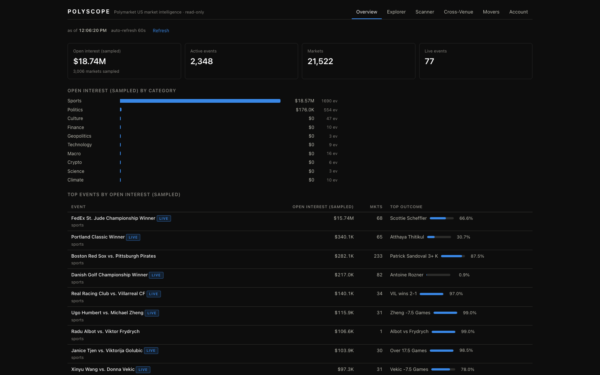
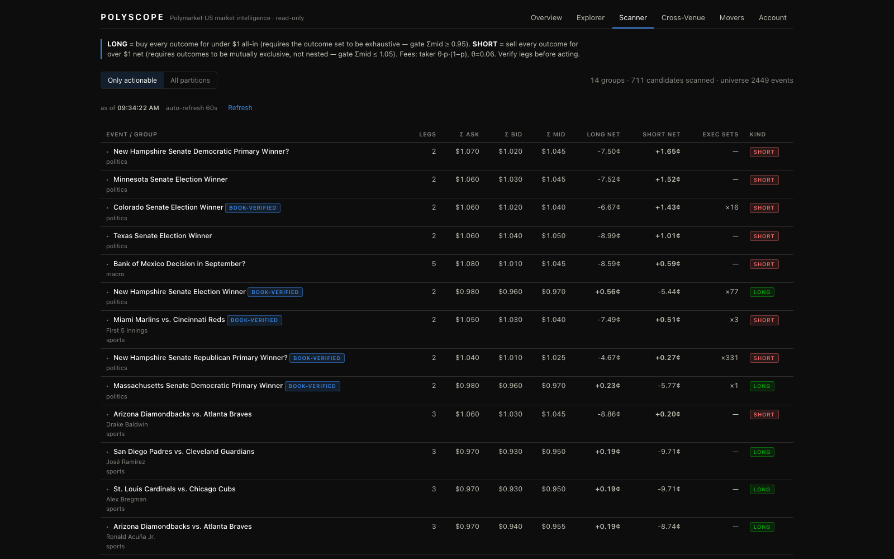

# Polyscope

A market-intelligence terminal for the [Polymarket US](https://polymarket.us) API: full-universe consistency scanning, cross-venue divergence vs Kalshi, an orderbook explorer, and in-session movers — built in about a day as an API exploration project.



The scanner, mid-scan on live data (book-verified rows re-priced from order-book tops):



## What it does

**Partition consistency / arb scanner.** For every active event, the scanner groups markets into candidate outcome sets (using the event's own `marketGroups` when present, otherwise the event's full market list) and prices both directions of the round trip, net of taker fees:

```
long edge  = 1 − Σask − Σ θ·p·(1−p)     (buy every outcome, collect $1 at settlement)
short edge = Σbid − 1 − Σ θ·p·(1−p)     (sell every outcome, owe $1 at settlement)
```

where θ is each market's `feeCoefficient` (0.06 taker). The two directions need different structure, so the flagging gates are asymmetric: a **long** flag requires the set to look *exhaustive* (Σmid ≥ 0.95 — a Dem/Rep pair summing to 0.90 isn't mispriced, a third party can win), while a **short** flag only requires *mutual exclusivity* (Σmid ≤ 1.05 — an unlisted outcome occurring makes every sold leg expire worthless, which only helps, but nested ladders like "over 3.5"/"over 9.5" can pay twice and price well above 1). Because the embedded quotes lag the matching engine, top candidates are then **re-priced from live order-book tops** before being flagged, along with the number of complete sets executable at best level.

**Cross-venue matcher (Polymarket US vs Kalshi).** Titles are tokenized (stopwords stripped, venue vocabulary normalized — hike/raise→increase, GOP→republican, bps→bp) and matched by Jaccard similarity, first event-to-event, then outcome-to-outcome within the best event match. Each pair carries `confidence = eventScore × outcomeScore` and a signed mid-price divergence; it's deliberately conservative and meant as a review queue, since "the same" market often differs in settlement source or deadline across venues.

**In-session movers.** The retail REST API has no historical prices, candles, or price-change fields, so Polyscope samples every market's mid price once a minute into an in-memory ring buffer (240 samples per market) and computes biggest movers over a selectable window. History starts accumulating the moment the server starts.

**Market explorer with live books.** Browse the ~2,700 active events by category, sampled open interest, end date, or the site's featured order; drill into any market for its full order book, BBO snapshot (last trade, open interest, depth counts), and per-event partition scan.

**Open-interest sampling.** The list endpoints define `volume`/`liquidity`/`openInterest` fields but never populate them (verified live), while per-market BBO responses carry real open interest. Polyscope closes the gap with a rotating sampler: every refresh cycle it BBO-polls a window of markets (live events first, then soonest-ending), accumulating an open-interest map that rankings degrade gracefully onto as coverage builds.

## Why these features

They fell out of the API investigation rather than the other way around:

- `GET /v1/events` embeds best bid/ask quotes on every nested market and allows `limit=500`, so scanning the entire universe (~2,700 events, ~20,000 markets) costs about **6 HTTP requests**. That makes a full-universe consistency scan cheap enough to run on demand.
- The list endpoints never populate their volume/OI fields, but per-market BBO does — which is what motivated the rotating open-interest sampler.
- Events expose `marketGroups` for multi-outcome partitions (e.g. `usfed-fomc-2026-09-16` splitting into hike/cut/hold outcome markets), and mutually-exclusive pricing is first-class in the product — so partition arithmetic is the natural analysis primitive.
- Kalshi's public API covers heavily overlapping topics (Fed, CPI, elections, sports) with no auth required, making cross-venue comparison a free extra dimension.
- The absence of any history endpoint in the retail API is what forced (and motivated) the self-sampling movers design.

## Quickstart

```bash
git clone <this-repo> && cd polyscope
npm install
cp .env.example .env   # API keys are OPTIONAL — leave blank for public-data mode

npm run dev            # dev: dashboard on http://localhost:5173, API proxied to :8787
# or
npm run build && npm start   # prod: everything served from http://localhost:8787
```

Without credentials, everything except the Account tab works — all market data comes from the public gateway. With credentials, the Account tab additionally shows balances, positions, and open orders (read-only).

The dashboard has six tabs:

| Tab | Backed by | Shows |
| --- | --- | --- |
| **Overview** | `/api/overview` | Universe totals, open interest by category (sampled), top events |
| **Explorer** | `/api/events`, `/api/markets/:slug/book` | Filterable event list, per-market order book + BBO |
| **Scanner** | `/api/scan` | Partition groups ranked by net edge, with executable-set depth |
| **Cross-Venue** | `/api/compare` | Polymarket↔Kalshi matches ranked by divergence, with confidence |
| **Movers** | `/api/movers` | Biggest mid-price moves since the server started sampling |
| **Account** | `/api/account` | Balances, positions, open orders (requires keys) |

## Configuration

| Variable | Required | Description |
| --- | --- | --- |
| `PMUS_KEY_ID` | no | Polymarket US API key UUID (from polymarket.us/developer). Blank = public-data mode. |
| `PMUS_SECRET` | no | Base64 Ed25519 secret (64-byte libsodium layout: seed ‖ public key; 32-byte raw seed also accepted). |
| `PORT` | no | Server port, default `8787`. |

Never commit a real `.env`; `.env.example` documents the shape.

## Architecture

```
server/src/
  index.ts           Express app, serves web/dist in prod, 60s mover-sampling loop
  config.ts          dependency-free .env loader
  pmus/
    client.ts        typed PMUS client (public gateway + retail API), TTL caches
    sign.ts          Ed25519 request signing (libsodium secret → PKCS#8 seed)
    types.ts         Event / Market / BBO / Book / Balance types
  kalshi/client.ts   minimal Kalshi public client (open events, nested markets)
  analysis/
    fees.ts          fee = θ·p·(1−p); taker θ=0.06, maker rebate θ=0.0125
    scanner.ts       partition grouping, asymmetric Σmid gates, long/short net edges
    matcher.ts       tokenizer + synonyms + numeric guard + Jaccard matching
    tracker.ts       in-memory mid-price ring buffer → movers
    sampler.ts       rotating BBO polls → open-interest map (list APIs omit OI)
  routes/api.ts      the REST surface the dashboard consumes
web/src/             Vite + React dashboard (the six tabs above)
```

Design choices: **no database** — everything is in-memory (TTL caches for the event universe, books, and account data; a ring buffer for price history). The client self-throttles to **10 req/s** via a token bucket, half of the API's documented 20 req/s limit, and the 45s event-universe cache means repeated scans mostly don't hit the network at all.

## API surface investigation

The most interesting output of this project may be the writeup: [docs/API_SURFACE.md](docs/API_SURFACE.md) maps all three Polymarket US hosts (public gateway, retail authenticated API, institutional exchange API) from live probing plus the official OpenAPI schemas. Highlights include the signing quirk that the Ed25519 message must contain the request path **without the query string** (signing `/v1/portfolio/positions?limit=5` → 401, signing `/v1/portfolio/positions` while requesting `?limit=5` → 200), and the verified wall between tiers — retail API keys get a hard 401 on `api.prod.polymarketexchange.com`, which requires separate institutional onboarding.

## Read-only by design

The client implements market-data and portfolio **reads only**. There is deliberately no code path for placing, modifying, or cancelling orders, and no RFQ or combo support — flagged "edges" are a consistency lens on public quotes, ignoring queue position, fill risk, and settlement timing. Nothing here is investment advice.

## Testing

```bash
npm test
```

Runs the server's Vitest suite, which covers the pure logic: signature message construction and secret-key decoding, the fee curve, partition grouping and edge math in the scanner, and the matcher's tokenizer/similarity scoring. Tests run offline — no live API calls.

## Limitations & next steps

- **Matcher precision.** Jaccard-on-titles is a heuristic; the synonym table is tiny and hand-built. A curated mapping file (or embedding similarity) would raise recall without sacrificing the review-queue framing.
- **Movers are ephemeral.** History lives in memory and resets on restart. Persisting samples (even to SQLite) would make windows meaningful across restarts.
- **Polling → streaming.** The API offers WebSocket market channels (same Ed25519 auth) and gRPC for institutional; subscribing would replace the 60s sampling loop with real-time ticks.
- **Fee model is the base schedule.** It uses per-market `feeCoefficient` and ignores volume-based taker rebates ($250k+/mo tiers), so net edges are conservative for high-volume accounts.
- **Partition detection is inferential.** Few events carry explicit `marketGroups`; everything else relies on the Σmid gates. The short-side gate (Σmid ≤ 1.05) excludes typical nested ladders but is a heuristic — adjacent nested lines can in principle price inside it, so flagged rows show their legs for human review before anyone acts.

## License

MIT — see [LICENSE](LICENSE).
